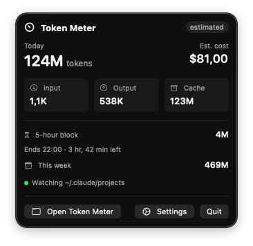
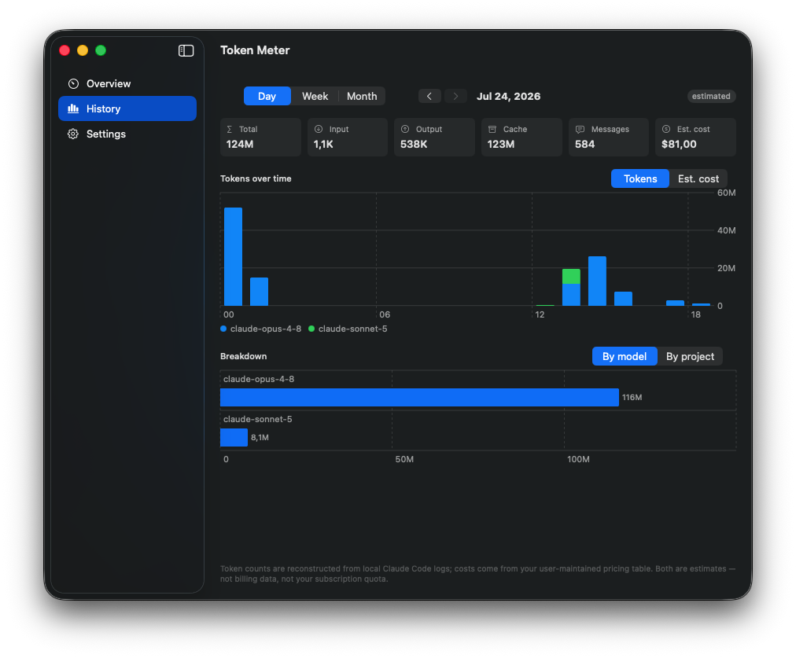
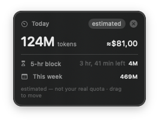

# TokenMeter

A native macOS **menu-bar app** that tracks your AI token usage and estimated cost across **Claude Code**, **Codex CLI**, and **local models via Ollama** — with usage history, Swift Charts, a desktop widget, and an optional always-on-top floating readout.

Local-first, no account, no telemetry. Everything is computed on your Mac from local log files; the only network calls are the ones you opt into (a daily pricing refresh and, if you use it, the local Ollama endpoint).

## ⚠️ The honesty guardrail — read this first

**TokenMeter cannot show your real Claude Pro/Max (or ChatGPT Plus) subscription quota.** Anthropic and OpenAI do not expose the 5-hour / weekly subscription limits through any public API. What TokenMeter shows is *reconstructed from local CLI logs* and clearly labeled **estimated** everywhere it appears.

| Data source | Accuracy | How |
|---|---|---|
| Claude Code logs (`~/.claude/projects/**/*.jsonl`) | **Estimated** — logs are known to under-report token counts, sometimes significantly | Local file parsing, no network |
| Codex CLI logs (`~/.codex/sessions`) | **Estimated** — same caveat as Claude Code | Local file parsing, no network |
| Ollama (local models) | **Measured** token counts, no cost (it's local) | Local REST API / pass-through proxy |

Numbers derived from local logs — including the reconstructed **5-hour block** and **weekly** views — approximate your usage from log timestamps. They are **not** your real remaining quota. Usage from the Claude/ChatGPT **web or desktop chat apps leaves no local trace** and is invisible to this tool. The 5-hour block is Claude-Code-only, so Codex/GPT usage never inflates the Claude subscription window.

> Developer API connectors (Anthropic/OpenAI Usage & Cost APIs — the *accurate, billing-grade* source) are planned but not in this release.

## Features

- 🖥️ **Menu-bar dashboard** — today's total tokens + estimated cost at a glance, with input/output/cache tiles.
- 🪟 **Desktop app window** — Overview / History / Settings in a `NavigationSplitView`, usable as a regular app (optional Dock icon).
- 📄 **Claude Code + Codex log parsing** with live FSEvents file-watching (near-real-time, append-aware, rotation-safe).
- ⏱️ **Estimated usage windows** — reconstructed 5-hour rolling block (with live countdown), plus daily and weekly rollups.
- 📊 **History & charts** — Swift Charts tokens/cost over time, broken down per-model and per-project, backed by a local SwiftData history DB.
- 💲 **Editable pricing** — bundled per-model $/token defaults, a daily community-sourced pricing feed, and per-model local overrides.
- 🧠 **Ollama integration** — token counts + latency/throughput for local models (loopback pass-through proxy; prompts are never inspected).
- 🧩 **Desktop widget** (WidgetKit) and an optional **floating HUD** panel to pin the readout on screen.

## Screenshots

<!-- Add exported PNGs under docs/img/ and they'll render here. -->

| Menu-bar dashboard | Desktop window (History) | Widget / floating HUD |
|---|---|---|
|  |  |  |

## Install

### Direct download (recommended)

Download the latest **notarized** `TokenMeter-<version>.dmg`, open it, and drag **Token Meter** to your Applications folder. Because the build is signed with a Developer ID and notarized by Apple, it opens with no Gatekeeper warning.

> Release downloads are hosted on the project website / GitHub Releases. (Link goes here once the first release is cut.)

### Build from source

```sh
git clone https://github.com/unichat-dev/token-meter.git
cd tokenmeter
make bootstrap   # installs xcodegen + gitleaks, wires the pre-commit hook, generates the Xcode project
make build       # or: make test
```

Requires **macOS 14 (Sonoma)** or later and **Xcode 16+**. Building from source signs ad-hoc, which is fine for local use (macOS may re-confirm file access between launches).

### Full Disk Access

To read Claude Code / Codex logs under your home folder, TokenMeter needs **Full Disk Access** (System Settings → Privacy & Security → Full Disk Access). The app detects the missing permission and walks you through granting it. Everything stays on your machine — log data is never uploaded anywhere.

## Privacy & security

- **All data stays local.** Log parsing happens on-device; history lives in a local database in `~/Library/Application Support/TokenMeter`.
- **No API keys in this release**, and when connectors land, keys will live in the **macOS Keychain only** — never the database, UserDefaults, plists, or logs.
- **Minimal, opt-in network.** A daily pricing-feed refresh (conditional GET) and the local Ollama endpoint are the only calls; nothing about your usage is transmitted.

Found a vulnerability? See [`SECURITY.md`](./SECURITY.md).

## Contributing

Contributions welcome — see [`CONTRIBUTING.md`](./CONTRIBUTING.md). Note the secret-scanning pre-commit hook setup there before your first commit.

## License

[Apache-2.0](./LICENSE) © UniChat Dev - Ilhan Akbudak
