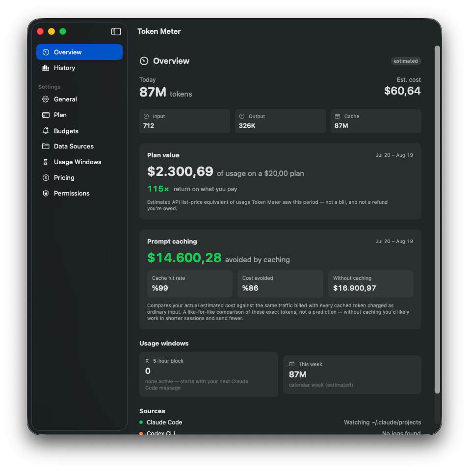

# TokenMeter

A native macOS **menu-bar app** that tracks your AI token usage and estimated cost across **Claude Code**, **Codex CLI**, and **local models via Ollama** — with usage history, Swift Charts, budget alerts, per-branch and per-agent attribution, a desktop widget, and an optional always-on-top floating readout.

Local-first, no account, no telemetry. Everything is computed on your Mac from local log files; the only network calls are the ones you opt into (a daily pricing refresh, an update check, and, if you use it, the local Ollama endpoint).

## ⚠️ The honesty guardrail — read this first

**TokenMeter cannot show your real Claude Pro/Max (or ChatGPT Plus) subscription quota.** Anthropic and OpenAI do not expose the 5-hour / weekly subscription limits through any public API. What TokenMeter shows is *reconstructed from local CLI logs* and clearly labeled **estimated** everywhere it appears.

| Data source | Accuracy | How |
|---|---|---|
| Claude Code logs (`~/.claude/projects/**/*.jsonl`) | **Estimated** — logs are known to under-report token counts, sometimes significantly | Local file parsing, no network |
| Codex CLI logs (`~/.codex/sessions`) | **Estimated** — same caveat as Claude Code | Local file parsing, no network |
| Ollama (local models) | **Measured** token counts, no cost (it's local) | Local REST API / pass-through proxy |

Numbers derived from local logs — including the reconstructed **5-hour block** and **weekly** views — approximate your usage from log timestamps. They are **not** your real remaining quota. Usage from the Claude/ChatGPT **web or desktop chat apps leaves no local trace** and is invisible to this tool. The 5-hour block is Claude-Code-only, so Codex/GPT usage never inflates the Claude subscription window.

### What the cost number actually means

This trips up everyone, so it's worth stating plainly: the dollar figure is the **API list-price equivalent** of your tokens — what they *would* have cost on pay-as-you-go billing. It is not a bill. On a subscription you pay the subscription price no matter what this says, which is why a $20/month plan can rack up hundreds of dollars of "cost" in a heavy month.

That's not a bug, it's the point — see [Plan value](#plan-value) below, which turns that number into something useful.

> Developer API connectors (Anthropic/OpenAI Usage & Cost APIs — the *accurate, billing-grade* source) are planned but not in this release.

## Features

- 🖥️ **Live menu-bar readout** — today's tokens, today's cost, 5-hour block progress, or your plan's value multiple, right in the status item.
- 💳 **Plan value** — tell it what you pay and it reframes cost as return on your subscription.
- 🔔 **Budgets & notifications** — ceilings on the 5-hour block, day, week, or billing period, with alerts at 50/80/100%.
- 🧠 **Prompt-cache analysis** — hit rate and what caching is saving you, the most actionable number in the app.
- 🌿 **Attribution** — usage broken down by git branch, session, subagent, and skill, not just model.
- 📄 **Claude Code + Codex log parsing** with live FSEvents file-watching (near-real-time, append-aware, rotation-safe).
- ⏱️ **Estimated usage windows** — reconstructed 5-hour rolling block (with live countdown), plus daily and weekly rollups.
- 📊 **History & charts** — Swift Charts tokens/cost over time, backed by a local SwiftData history DB.
- 📤 **Export** — CSV or JSON for any period, including per-event cost and attribution.
- 💲 **Editable pricing** — bundled per-model $/token defaults, a daily community-sourced pricing feed, and per-model local overrides.
- 🧠 **Ollama integration** — token counts + latency/throughput for local models (loopback pass-through proxy; prompts are never inspected).
- 🧩 **Desktop widget** (WidgetKit) and an optional **floating HUD** panel to pin the readout on screen.

## Screenshots

| Menu-bar dashboard | Desktop window (Overview) | Desktop window (History) | Widget / floating HUD |
|---|---|---|---|
|  |  |  |  |

---

## What's new in 2.0

### Cost correctness

Three fixes to how cost is computed. All three make the number match what Anthropic would actually bill for the same tokens.

**Cache writes are billed by TTL.** Anthropic charges 1.25× base input for a 5-minute cache entry but **2× for a 1-hour** one. Claude Code reports the split in a nested `cache_creation` object; TokenMeter 1.x read only the flat total and applied the cheaper rate to everything. On a real heavy-usage month where 92% of cache writes were 1-hour, that understated cost by ~6.4%.

`TokenCounts` now carries `cacheCreation5m` and `cacheCreation1h` as a *breakdown* of the flat total — deliberately excluded from `total` so nothing double-counts. `CostEngine` bills the 5-minute portion and any unattributed remainder at the base rate, and the 1-hour portion at the higher rate. When a pricing feed doesn't publish a 1-hour rate, it's derived as 2× base input, gated on the model actually having a cache price so models without prompt caching never get an invented one. Logs with only the old flat field bill exactly as before.

**Server tool calls are billed.** `server_tool_use.web_search_requests` is charged per request (~$10 per 1,000), not per token. Web *fetch* is recorded but not charged, because Anthropic bills it through the tokens it returns.

**The bundled price table ships current.** `Resources/default-pricing.json` is the offline fallback used on a first launch with no network. It had gone stale and was missing current models entirely, which silently dropped them from every total. It's now regenerated at release time, and a test fails if a current Claude model can't be priced from it.

### Plan value

Settings → Plan. Pick your plan (Claude Pro, Max 5×, Max 20×, ChatGPT Plus/Pro, pay-as-you-go, or custom), set the price and your renewal day, and the Overview reframes the headline number:

```
$1,038.25 of usage on a $20.00 plan
52× return on what you pay
```

Billing periods are anchored to your **renewal day**, not the 1st — subscriptions renew on the day you signed up. The day is clamped to 1–28 so every month has it.

Three honesty rules are enforced by tests:

- It's labeled an **estimate of API list-price equivalent**, never a bill or a refund you're owed.
- When history doesn't reach the start of the period, it's flagged **partial** — the figure is a floor, not a total.
- Unpriced models are named inline, because their usage is excluded and understates the multiple.

On pay-as-you-go there's no multiple to show, since the estimate already approximates the invoice.

### Budgets & notifications

Settings → Budgets. Ceilings on four windows:

| Scope | Unit | Limit comes from |
|---|---|---|
| 5-hour block | tokens | the reference in Usage Windows |
| Today | USD | your number |
| This week | USD | your number |
| This billing period | USD | your number |

Alerts fire at **50 / 80 / 100%** through `UNUserNotificationCenter`. The block budget deliberately has no limit field of its own — it reuses the reference already configured in Usage Windows, because two settings meaning the same number will eventually disagree.

**How the anti-spam rules work.** A ledger records which thresholds have fired, keyed by scope *and window instance* (today's date, this block's start time, the billing period start). A new day or block therefore resets the slate automatically, with no scheduled job. Crossing several thresholds in one tick fires only the **highest** — going 0% → 90% produces one 80% alert, not an 80% and a 50%. Exceeding a budget doesn't re-alert. The ledger is persisted, so relaunching mid-day doesn't replay alerts you dismissed, and it prunes rolled-over windows so it can't grow without bound.

Notification copy never says "remaining", "left", or "allowance" — a test fails the build if it does — because those words would turn an estimate into a promise about vendor quota.

Notifications only fire while the app is running. There is no background daemon, by design.

### Prompt-cache analysis

In agentic coding the whole conversation prefix is re-sent every turn, so cache reads dominate both token counts and cost — often 75%+ of the bill. The Overview panel shows the hit rate and compares your actual cost against **the same tokens billed with no cache tiers at all**.

This is a like-for-like comparison of the exact traffic you generated, *not* a prediction — without caching you'd work in shorter sessions and send fewer tokens. The panel says so. Note that cache *writes* cost more than plain input ($6.25 vs $5.00 per MTok on Opus), so caching is a net loss on writes; the reads are what carry it, and the math reflects that rather than assuming caching always wins.

### Attribution

Claude Code records the session, git branch, subagent, and skill on every log line. TokenMeter now captures all of it, so History can break usage down **by branch, by session, by agent, and by skill** — not just by model. That answers questions a per-model total can't: what did this feature branch cost, which subagent burns the most tokens, which skill is expensive.

Attribution uses `attributionAgent` (the subagent *type*, like `general-purpose` or `Explore`) rather than the opaque `agentId` instance hash, which would be useless as a grouping key. Blank strings normalize to nothing, so you never get a phantom empty row. Rows recorded before attribution shipped group under "Unattributed" rather than being silently dropped.

### Export

History → Export. CSV or JSON for whatever period is on screen, so the file always matches the numbers you're looking at. Includes per-event estimated cost, all token tiers, and full attribution.

Unpriced models and local Ollama models leave the cost cell **empty** rather than writing `0`, which would imply a priced zero. CSV output is RFC 4180 quoted, and values starting with `=`, `+`, `-`, or `@` are prefixed with an apostrophe so a branch named `=cmd|...` can't execute as a formula when the file is opened in Excel or Numbers.

### Menu-bar readout & launch behavior

The status item shows a live value beside the gauge — today's tokens (default), today's cost, block progress, or your plan multiple. When a metric has nothing to report yet, the readout hides rather than showing a dash or a misleading `0`.

The app no longer forces its window open at every launch. It opens once on first run so the permissions flow is discoverable, then starts quietly in the menu bar. *Open the main window at launch* is available in Settings if you want the old behavior. **Start Token Meter at login** uses `SMAppService`; because you can also change it in System Settings → Login Items, the toggle reads the real state back rather than assuming.

### Update checks

Settings → General shows your version and checks GitHub Releases for a newer one. It only *tells* you — nothing is downloaded or installed automatically, and nothing about your usage is transmitted. This is deliberately not Sparkle: the project ships with zero third-party dependencies, and a self-updating framework is a lot of privileged machinery for an app that installs by dragging a DMG.

### Performance

Two changes, both measured on a real 343 MB / 63,916-line log tree with 25,000 stored events.

**Persisted read offsets.** Every launch used to re-read every byte of the log tree and re-parse every line, only for the id-dedupe to discard nearly all of it. Read offsets now persist per file (with inode tracking), so a warm start is proportional to what's actually new: **~34s → ~2s**.

The offset file is stamped with a *parser generation*. Bumping it — done whenever the parser learns to extract more from the same line — discards stored offsets so the next launch re-reads once and back-fills the richer fields into existing history. Ingestion upserts by event id, so the replay is idempotent. This is what let the 2.0 cache-TTL and attribution fields reach data recorded by 1.x.

**Day-bucketed rollups.** Rollups used to filter the whole event array a dozen times per refresh, on a 300 ms throttle — 349 ms of work per pass at 25k events, which saturated the main thread during backfill. `UsageIndex` keeps running totals per (day × model), making a refresh **349 ms → 0.098 ms**.

Aggregating before pricing is safe because `CostEngine.cost` is linear in every token tier and request count: pricing the sum of a model's tokens yields exactly the same `Decimal` as summing per-event prices. That's not taken on faith — equivalence tests assert the indexed path returns identical results to the per-event path for all-time, daily, weekly, and billing-period windows.

### Settings navigation

Seven pages behind an unlabeled icon strip meant clicking through every icon to find anything. Settings is now a **sidebar list**, in both the ⌘, window and the main window — where the pages are entries in the existing sidebar, so each is one click away rather than buried behind a second nested sidebar. Every page has a one-line summary of what it's for.

---

## Install

### Direct download (recommended)

Download the latest **notarized** `TokenMeter-<version>.dmg` from [Releases](https://github.com/unichat-dev/token-meter/releases) or from [unichat.dev](https://unichat.dev/en/open-source/token-meter), open it, and drag **Token Meter** to your Applications folder. Because the build is signed with a Developer ID and notarized by Apple, it opens with no Gatekeeper warning.

### Build from source

```sh
git clone https://github.com/unichat-dev/token-meter.git
cd token-meter
make bootstrap   # installs xcodegen + gitleaks, wires the pre-commit hook, generates the Xcode project
make build       # or: make test
```

Requires **macOS 14 (Sonoma)** or later and **Xcode 16+**. Building from source signs ad-hoc, which is fine for local use (macOS may re-confirm file access between launches).

`make release` is maintainer-only — it needs this project's Developer ID certificate and notarization credentials, which aren't in the public repo.

### Full Disk Access

To read Claude Code / Codex logs under your home folder, TokenMeter needs **Full Disk Access** (System Settings → Privacy & Security → Full Disk Access). The app detects the missing permission and walks you through granting it. Everything stays on your machine — log data is never uploaded anywhere.

## How it works

```
~/.claude/projects/**/*.jsonl ─┐
~/.codex/sessions/**/*.jsonl  ─┼─→ JSONLLogWatchSource ─→ parser ─→ UsageEvent
Ollama proxy                  ─┘      (FSEvents +              │
                                       persisted offsets)      ▼
                                                         ┌───────────┐
                                                         │ AppModel  │
                                                         └─────┬─────┘
                                            ┌──────────────────┼──────────────────┐
                                            ▼                  ▼                  ▼
                                      UsageIndex         SwiftData store     BudgetEvaluator
                                   (day × model totals)   (durable history)   (→ notifications)
                                            │
                                            ▼
                              summaries · cost · plan value · cache efficiency
```

- **Sources** watch log directories with FSEvents, read only bytes appended since the last offset, and emit normalized `UsageEvent`s. Offsets persist across launches; rotation and truncation are detected by inode and size.
- **Parsers** are pure line-in / event-out, and never log line contents (log lines embed your prompts).
- **`UsageIndex`** maintains day × model running totals for O(days) rollups.
- **`CostEngine`** does all money math in `Decimal` — no floating-point drift.
- **SwiftData** stores history durably, keyed by a unique event id so re-scans upsert rather than duplicate.

Schema changes are additive with defaults, so store migrations stay lightweight.

## Privacy & security

- **All data stays local.** Log parsing happens on-device; history lives in a local database in `~/Library/Application Support/TokenMeter`.
- **No API keys in this release**, and when connectors land, keys will live in the **macOS Keychain only** — never the database, UserDefaults, plists, or logs.
- **Minimal, opt-in network.** A daily pricing-feed refresh, an update check against GitHub Releases, and the local Ollama endpoint are the only calls. Nothing about your usage is transmitted by any of them.

Found a vulnerability? See [`SECURITY.md`](./SECURITY.md).

## Contributing

Contributions welcome — see [`CONTRIBUTING.md`](./CONTRIBUTING.md). Note the secret-scanning pre-commit hook setup there before your first commit.

## License

[Apache-2.0](./LICENSE) © UniChat Dev - Ilhan Akbudak
